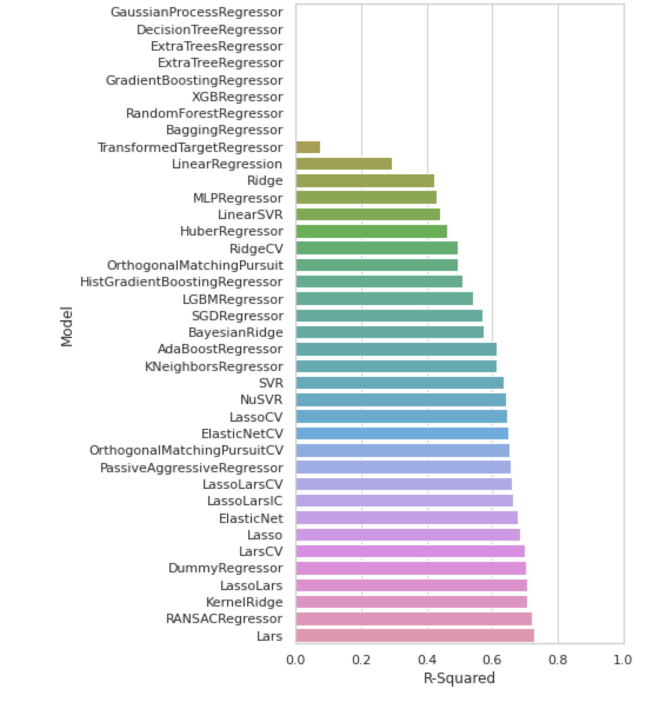
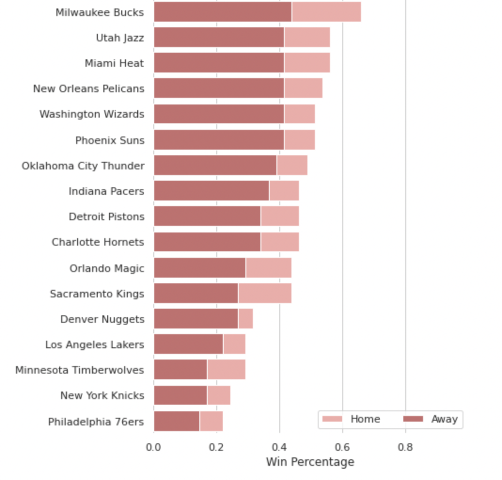

# Justin Dreyer
*Master's Student, Applied Information and Data Science*

# Education
* Masters of Science, Applied Information and Data Science, *HSLU*, 2021-2023
* Master of Chemistry, *University of St Andrews*, 2014-2020

# QSAR modeling of Histamine H3 agonists/inverse agonists

  
This projects pulls data from the ChEMBL database in order to create a QSAR model of Histamine H3 agonists/inverse agonists.
* **Python libraries used:** Pandas, numpy, rdkit, Seaborn, padelpy, matplotlib, sklearn
* **Input:** ChEMBL canonical smiles notation and IC50 values
* **Output:** QSAR model of Histamine H3 agonists/inverse agonists

# Sports analytics: Homecourt advantage in the National Basketball Association

* Team statistics web-scraped from www.NBA.com 
* Exploratory data analysis and visualization of the win percentage of teams, when playing at their home stadium versus opponent’s stadium
* Discovered that on average, teams win 35% more games when playing in their own stadium
  

